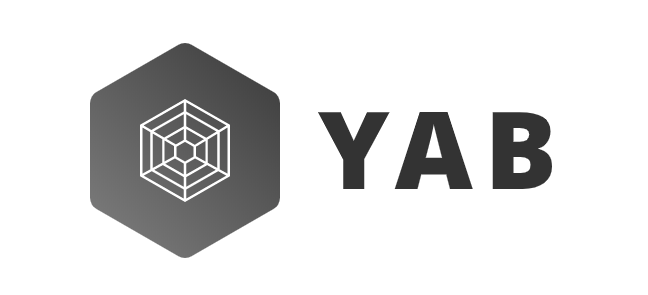

English | [简体中文](./README.zh-CN.md)

Some tools fot fetch.

## Introduction
There is no good high-level libs base on Fetch API, so we create yab.

## Packages

This repository is a monorepo that we manage using Lerna. That means that we actually publish several packages to npm from the same codebase, including:

| Package                                                      | Version                                                      | Description                                              |
| ------------------------------------------------------------ | ------------------------------------------------------------ | -------------------------------------------------------- |
| [`yab-fetch`](/packages/yab-fetch)                           |  | The fetch library.                                       |
| [`yab-fetch-middleware-cache`](/packages/yab-fetch-middleware-cache) |  | A yab middleware, fouse on cache response using IndexDB. |

## Documentation
Please read each package's README.

## Changelog
Detailed changes for each release are documented in [CHANGELOG.md](./CHANGELOG.md).

## License

[MIT](http://opensource.org/licenses/MIT)
