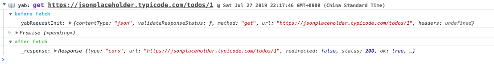

# yab-fetch-middleware-log

## Install

`npm i yab-fetch-middleware`

## Useage

```ts
import { createFetch } from 'yab-fetch';
import { createLogger } from 'yab-fetch-middleware-logger';

const logger = createLogger({
  // options
});

const request = createFetch({
  middleware: [logger],
});
```

## Example


